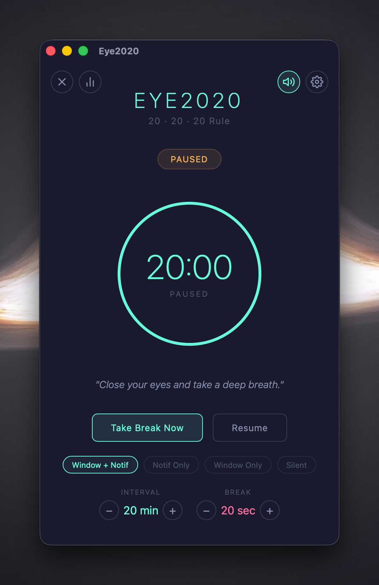
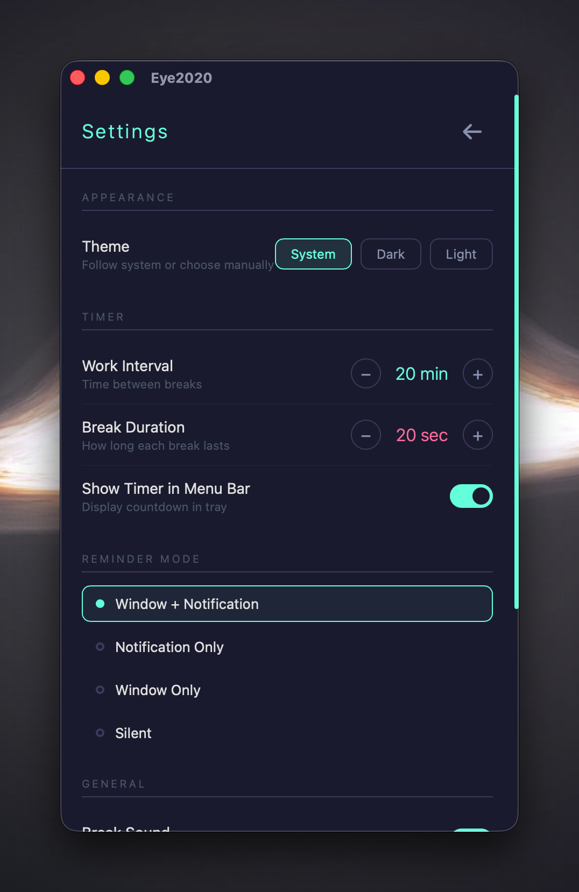
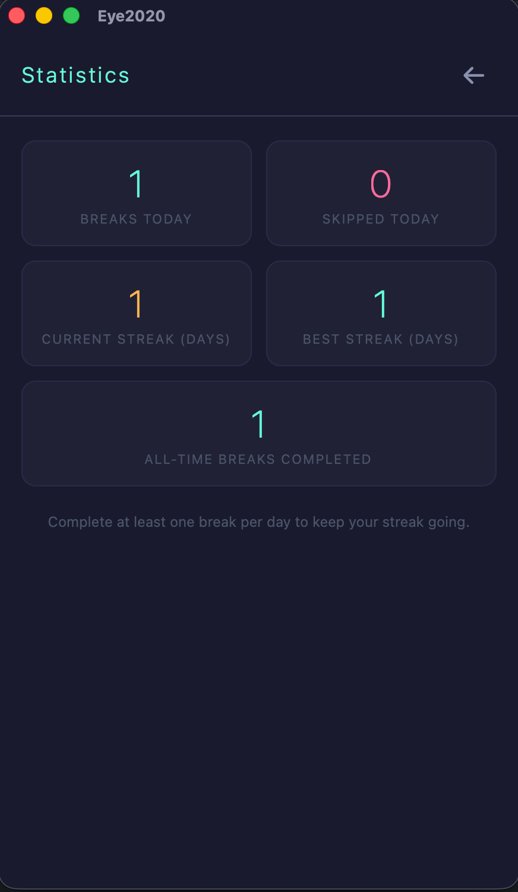

# Eye2020

A macOS menu bar utility that helps you follow the **20-20-20 rule** for eye strain prevention.

> Every **20 minutes** of screen time, look at something **20 feet** away for **20 seconds**.

## Screenshots

| Dashboard | Settings | Statistics |
|:---------:|:--------:|:----------:|
|  |  |  |

## Features

- **Menu bar timer** — Live countdown in the macOS menu bar
- **Break reminders** — Animated countdown window with eye care tips
- **macOS notifications** — Native notification alerts when breaks are due
- **Persistent status notifications** — Every 5 min shows remaining time; click to open
- **Reminder modes** — Window + Notification, Notification Only, Window Only, or Silent
- **Configurable intervals** — Set work interval (5–120 min) and break duration (5–60 sec)
- **Pause/Resume** — Quick toggle from the tray menu or dashboard
- **Take Break Now** — Trigger a break anytime
- **Single instance** — Running `eye2020` again brings the existing window to front (no duplicates)
- **Stays in tray** — Closing the window keeps the app running in the background
- **Launchpad & Spotlight** — Install as a proper macOS `.app` bundle

## Tech Stack

- **Rust** + **Tauri v2** (backend + native shell)
- **HTML/CSS/JS** (frontend webview)
- **Tokio** async runtime (battery-efficient timers)
- **tauri-plugin-notification** (macOS native notifications)
- **Unix domain socket** (single-instance IPC)

---

## Prerequisites

| Requirement | Install Command |
|-------------|----------------|
| **Rust** | `curl --proto '=https' --tlsv1.2 -sSf https://sh.rustup.rs \| sh` |
| **Tauri CLI v2** | `cargo install tauri-cli --version "^2"` |
| **Xcode Command Line Tools** | `xcode-select --install` |

> **Note:** No Node.js required — the frontend is plain HTML/CSS/JS (no bundler).

Verify your setup:
```bash
rustc --version        # Rust compiler
cargo --version        # Cargo package manager
cargo tauri --version  # Tauri CLI (should be 2.x)
```

---

## Build & Install (Full Guide)

### Step 1: Clone the project

```bash
git clone <your-repo-url> EyeCare
cd EyeCare
```

### Step 2: Build debug (for development)

```bash
cd src-tauri
cargo build
cargo run          # Run with logs visible in terminal
```

### Step 3: Build release (optimized binary)

```bash
# From project root
cargo tauri build
```

This creates:
```
src-tauri/target/release/eye2020                              # Binary
src-tauri/target/release/bundle/macos/Eye2020.app             # macOS .app bundle
```

### Step 4: Install to Applications (shows in Launchpad & Spotlight)

```bash
cp -R src-tauri/target/release/bundle/macos/Eye2020.app /Applications/
```

After copying, Eye2020 will appear in:
- **Launchpad** — Open Launchpad, find the Eye2020 icon
- **Spotlight** — Press `Cmd+Space`, type "Eye2020"
- **Finder** — Go to `/Applications/Eye2020.app`

### Step 5: Rebuild after code changes

```bash
# Rebuild and reinstall
cargo tauri build && cp -R src-tauri/target/release/bundle/macos/Eye2020.app /Applications/
```

---

## Running the App

### From Launchpad / Spotlight (recommended)
1. Press `Cmd+Space` → type "Eye2020" → press Enter
2. Or open Launchpad and click the Eye2020 icon

### From CLI
```bash
# Run the release binary directly
./src-tauri/target/release/eye2020

# Or open the .app bundle
open /Applications/Eye2020.app

# Run in background (keeps running after terminal closes)
nohup ./src-tauri/target/release/eye2020 &
```

### Single Instance Behavior

If Eye2020 is already running, launching it again will **not** create a duplicate — it will bring the existing window to front:

```bash
# First launch — starts the app
./src-tauri/target/release/eye2020 &

# Second launch — brings existing window to front and exits
./src-tauri/target/release/eye2020
# Output: "Eye2020 is already running — bringing window to front."
```

This works via a Unix domain socket (`~/.eye2020.sock`) for IPC between instances.

### Reopen the Window (if closed)

Closing the window does **not** quit the app — it hides to the tray. To reopen:

| Method | How |
|--------|-----|
| **CLI** | Run `eye2020` again (signals existing instance) |
| **macOS open** | `open /Applications/Eye2020.app` |
| **Dock** | Click the Eye2020 icon in the Dock |
| **Tray menu** | Click tray icon → "Show Eye2020" |
| **Spotlight** | `Cmd+Space` → "Eye2020" |

---

## Stopping the App

```bash
# From tray menu
# Click tray icon → "Quit Eye2020"

# From CLI
pkill -x eye2020

# Or find PID and kill
pgrep -x eye2020    # shows PID
kill <PID>
```

---

## Quick Reference

| Action | Command |
|--------|---------|
| Build debug | `cd src-tauri && cargo build` |
| Build release + .app | `cargo tauri build` |
| Install to Applications | `cp -R src-tauri/target/release/bundle/macos/Eye2020.app /Applications/` |
| Run (foreground) | `./src-tauri/target/release/eye2020` |
| Run (background) | `nohup ./src-tauri/target/release/eye2020 &` |
| Open via Spotlight | `Cmd+Space` → "Eye2020" |
| Open via CLI | `open /Applications/Eye2020.app` |
| Show window (if hidden) | Run `eye2020` again, or click Dock/tray icon |
| Check if running | `pgrep -x eye2020` |
| Stop | `pkill -x eye2020` or Tray → Quit |

---

## Configuration (In-App)

The dashboard UI lets you adjust:

| Setting | Range | Default | How |
|---------|-------|---------|-----|
| Work interval | 5–120 min | 20 min | `+`/`−` buttons on dashboard |
| Break duration | 5–60 sec | 20 sec | `+`/`−` buttons on dashboard |
| Reminder mode | 4 options | Window + Notif | Click mode chips on dashboard |
| Timer in menu bar | On/Off | On | Tray menu → Toggle |

---

## App Behavior

1. **Starts monitoring** — 20-minute countdown begins
2. **Menu bar** — Shows live countdown (e.g., `18:32`) in the tray
3. **Status notifications** — Every 5 minutes, a notification shows remaining time
4. **Break time** — At 0:00, shows break overlay + sends notification
5. **Break countdown** — Click "Start Break" for a 20-second eye rest timer
6. **Repeat** — Timer resets and the cycle continues
7. **Close window** — App hides to tray, keeps running
8. **Re-launch** — Brings existing window back (no duplicate)

---

## Project Structure

```
EyeCare/
├── frontend/
│   └── index.html                — Dashboard + break overlay UI
├── src-tauri/
│   ├── Cargo.toml                — Rust dependencies
│   ├── tauri.conf.json           — Tauri app config
│   ├── capabilities/
│   │   └── default.json          — IPC permission capabilities
│   ├── icons/                    — App icons (all sizes + .icns)
│   └── src/
│       ├── main.rs               — Entry point, single-instance, IPC socket, Tauri setup
│       ├── commands.rs           — IPC commands (get_state, take_break, set_interval, etc.)
│       ├── app/
│       │   ├── app_state.rs      — Shared state (timer, status, settings)
│       │   ├── timer_engine.rs   — Async countdown loop + status notifications
│       │   └── break_manager.rs  — Break lifecycle + random eye care tips
│       ├── ui/
│       │   └── tray.rs           — Menu bar tray icon and dropdown menu
│       ├── system/
│       │   └── screen_monitor.rs — macOS screen sleep/wake detection
│       └── data/
│           └── stats_store.rs    — Statistics & settings persistence (SQLite)
├── README.md
└── PLAN.md
```

---

## Tray Menu Options

| Option | Action |
|--------|--------|
| Show Eye2020 | Open/focus the dashboard window |
| Take Break Now | Trigger an immediate eye break |
| Pause / Resume | Toggle the countdown timer |
| Window + Notif | Break shows window and notification |
| Notification Only | Break sends notification only |
| Window Only | Break shows window only |
| Silent | No alerts (timer still runs) |
| Show Timer in Menu Bar | Toggle countdown display in tray |
| Quit Eye2020 | Exit the application completely |

---

## Roadmap

- [x] Core timer engine (20-20-20 countdown)
- [x] Menu bar tray icon with live countdown
- [x] Break reminder overlay with animated countdown
- [x] macOS native notifications
- [x] Persistent status notifications (every 5 min)
- [x] Reminder mode selection (4 modes)
- [x] Configurable interval and break duration
- [x] Single-instance protection with window focus via IPC
- [x] Dock icon reopen support
- [x] Launchpad / Spotlight / .app bundle
- [x] Custom app icon
- [x] Statistics tracking (breaks completed, streaks) — SQLite
- [x] Settings persistence (SQLite)
- [x] Auto-start on login
- [x] Dark mode theme detection
- [x] Settings & Statistics panels with icon buttons
- [x] Screen sleep/wake detection

## License

MIT
